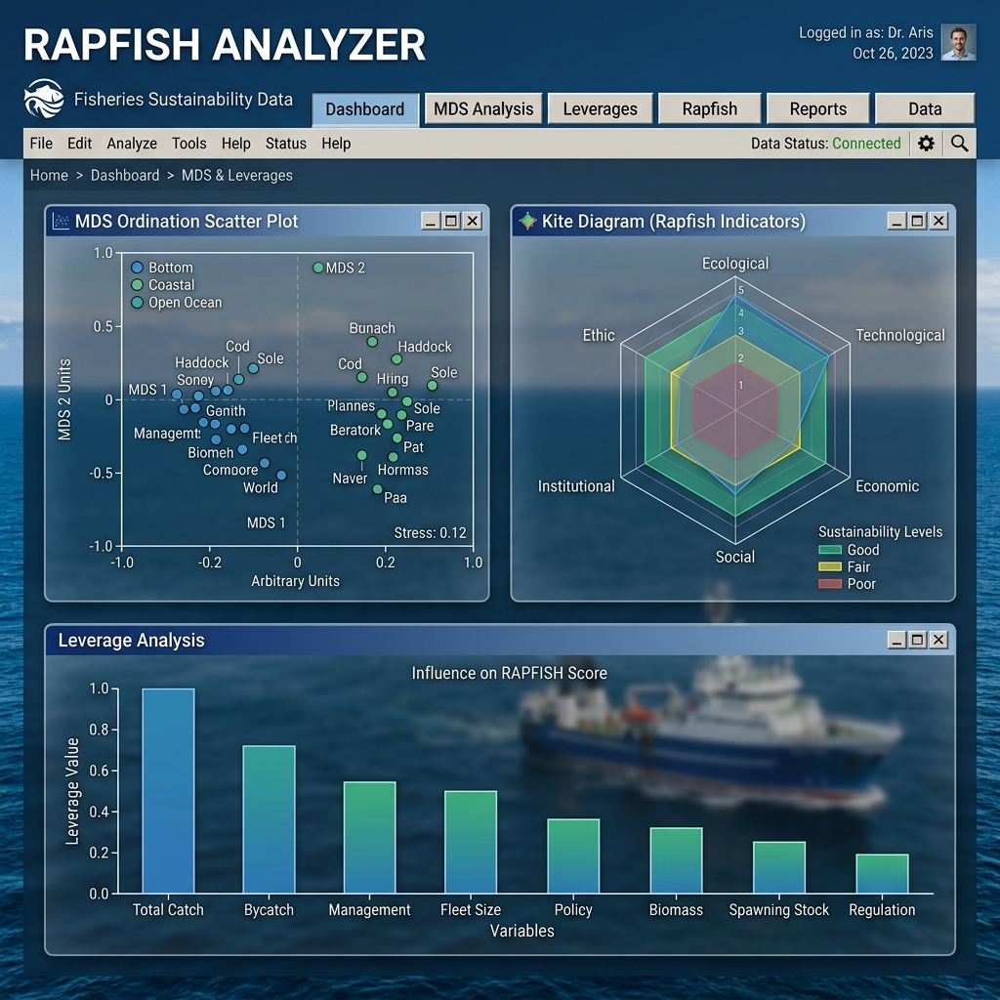

# 🐟 RAPFISH - Multi-Dimensional Scaling for Fisheries Sustainability



## 🚀 Overview
**RAPFISH** (Rapid Appraisal for Fisheries) is a multi-dimensional scaling (MDS) based tool designed to evaluate the sustainability of fisheries. This project is a modern, web-based implementation of the classic Rapfish (originally built as an Excel Add-in) that brings the same powerful statistical analysis (SPSS ALSCAL style) to a user-friendly browser interface.

This tool allows researchers and policy-makers to upload fisheries data and instantly generate sustainability scores across multiple dimensions, including Ecological, Economic, Social, Technological, and Institutional factors.

## ✨ Key Features
- **MDS Ordination (ALSCAL Style):** High-precision MDS calculation with rotated and scaled coordinates (0-100 sustainability score).
- **Advanced Statistics:** Instant calculation of **Stress-1** and **RSQ (Squared Correlation)** to validate model reliability.
- **Leverage Analysis:** Identify which attributes most influence the sustainability score through Root Mean Square (RMS) sensitivity analysis.
- **Monte Carlo Simulation:** Analyze the effect of scoring uncertainty with distribution histograms and confidence interval plots (95% CI & 50% IQR).
- **Kite Diagram (Radar Chart):** Professional visualization of sustainability status across all dimensions in a single "kite" model.
- **Windows Classic UI:** A nostalgic interface that mimics the original VBA-based program for familiarity and ease of use.
- **Excel Export:** Export all numerical results, charts, and matrices back to a formatted Excel file for reporting.

## 🛠️ Technology Stack
- **Backend:** Python, Flask
- **Data Science:** NumPy, Pandas, Scikit-Learn
- **Frontend:** HTML5, CSS3 (VBA Classic Style), Chart.js
- **Export:** XlsxWriter

## 🖥️ How to Run
To run this project locally, follow these steps:

1. **Clone the repository:**
   ```bash
   git clone https://github.com/YOUR_USERNAME/Web-Rapfish.git
   cd Web-Rapfish
   ```

2. **Install dependencies:**
   ```bash
   pip install -r requirements.txt
   ```

3. **Run the application:**
   ```bash
   python app.py
   ```

4. **Access the app:**
   Open your browser and go to `http://127.0.0.1:5000`

## 📦 For Windows Users (Portable Version)
If you are on Windows and don't have Python installed, you can download the standalone `.exe` version from the [Releases](https://github.com/YOUR_USERNAME/Web-Rapfish/releases) page. Just download and run `RapfishAnalyzer.exe`.

## 📊 Methodology
This tool follows the standard Rapfish methodology:
1. **Normalization:** All attribute scores are normalized using Min-Max scaling between "GOOD" and "BAD" anchors.
2. **Euclidean Distance:** Calculates the distance matrix between all fisheries and anchors.
3. **MDS Algorithm:** Uses Metric MDS to find the best 2D coordinates.
4. **Procrustes Rotation:** Rotates the results so that "BAD" is at (0,0) and "GOOD" is at (100,0) on the X-axis.

---
Developed with ❤️ for Fisheries Science.
